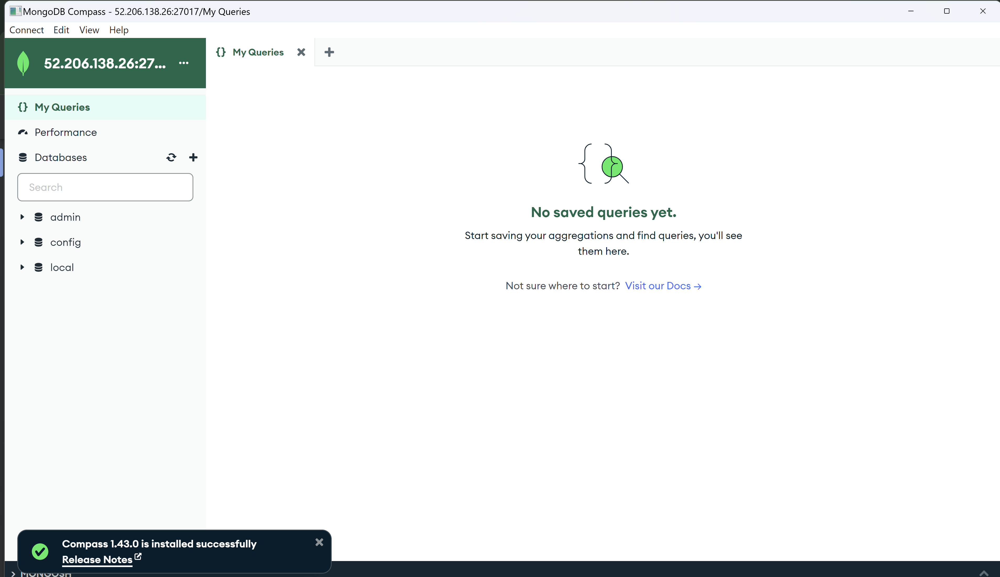
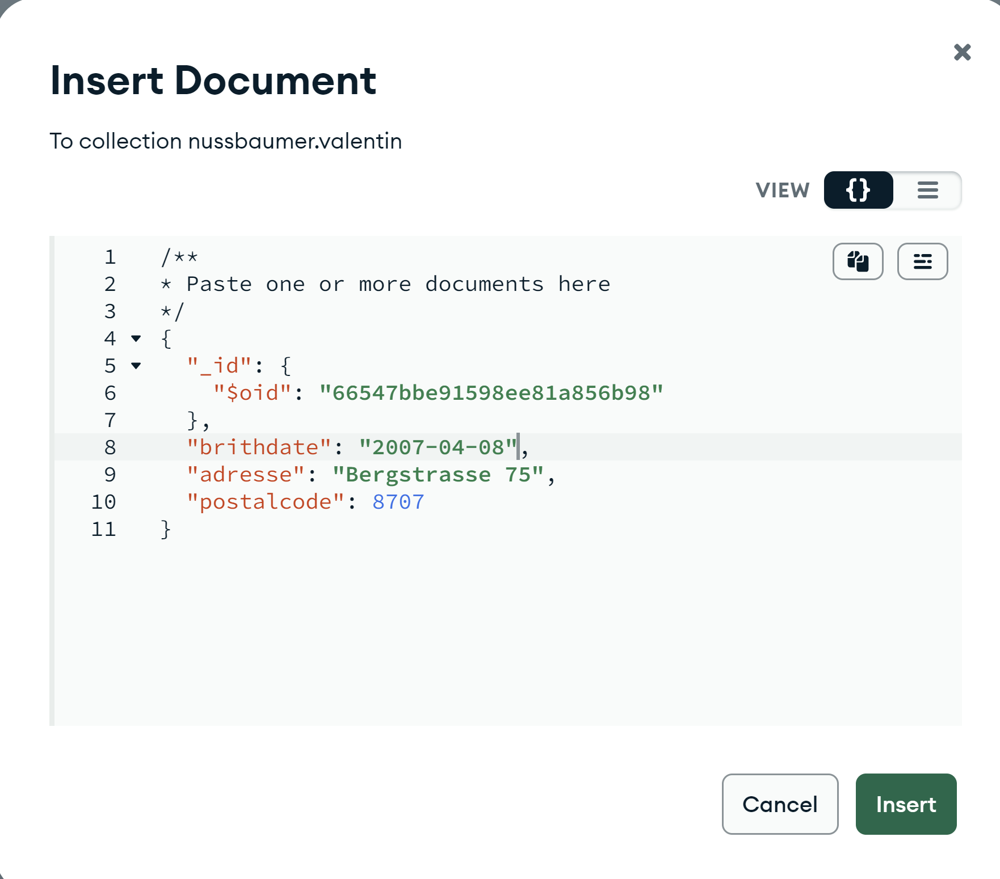
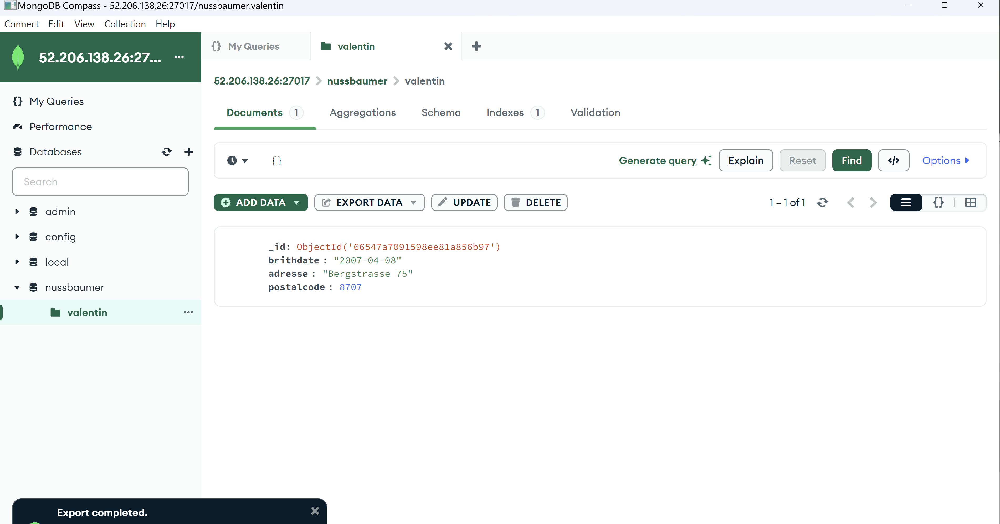
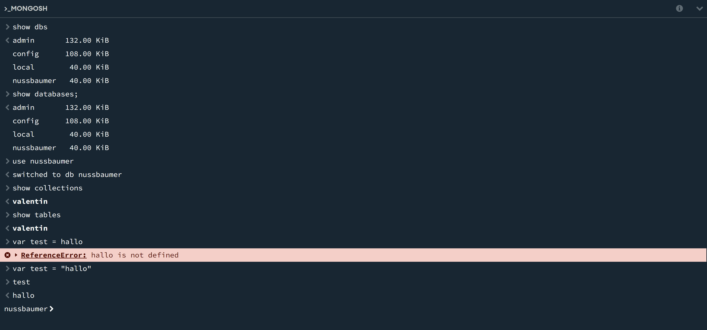
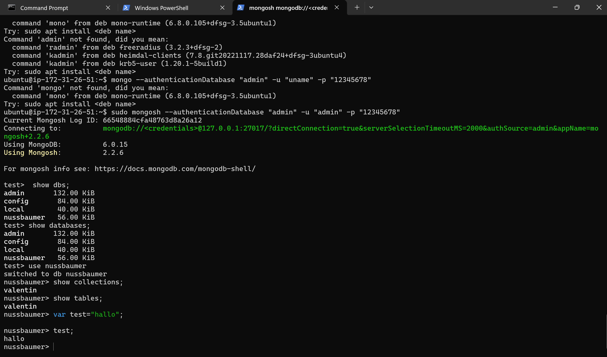

# m165
## A) Installation (40%)

Die Option authSource=admin im MongoDB-Connection-String bedeutet, dass die Anmeldung über die admin-Datenbank läuft. Das ist korrekt, wenn die Benutzer dort angelegt sind, auch wenn du auf eine andere Datenbank zugreifst. So wird die Authentifizierung zentral verwaltet.

Mit dem Befehl: sed kann man text verändern.
Zum Beispiel mit diesem befehl: `sudo sed -i 's/#security:/security:\n  authorization: enabled/g' /etc/mongod.conf` im cloud init abgeändert, wie man es hier (rot markiert) sehen kann: 

Diese spezifischen befehle werden verwendet:
- `sudo sed -i 's/127.0.0.1/0.0.0.0/g' /etc/mongod.conf
` > ändert die MongoDB-Konfiguration so, dass MongoDB Verbindungen von allen IP-Adressen funktionieren, nicht nur von localhost
- `sudo sed -i 's/#security:/security:\n  authorization: enabled/g' /etc/mongod.conf` >
aktiviert die Sicherheitsoptionen in der MongoDB-Konfiguration und schaltet die authorisierung ein.

## B) Erste Schritte GUI (40%)



Ich konnte den datentyp zu Date in der UI ändern. Durch das exportieren konnte ich sehen, wie ich es machen müsste.
So: 
```
  "brithdate": {
    "$date": "2007-04-08T00:00:00.000Z"
  }
```

## C) Erste Schritte Shell (20%)

sudo mongosh --authenticationDatabase "admin" -u "admin" -p "12345678"


- 1, 2 geben alle Datenbanken auf dem MongoDB server aus
- 3 verbindet sic zu der angegeben Datenbank
- 4, 5 zeigt mir alle Tabellen in der ausgewählten Datenbank. Collections ist ein Synonym fuer Tabellen, deshalb wird auch das selbe angezeigt.