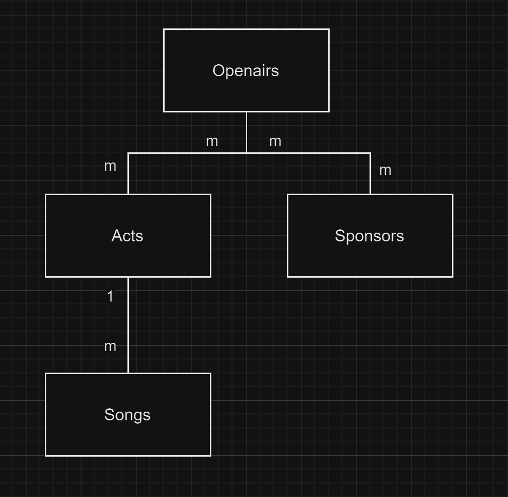

# KN02: Datenmodellierung für MongoDB
## A) Konzeptionelles Datenmodell (40%)

Dieses Drigramm stellt den Aufbau eines Musikfesivals dar. Ein Song kann nur einn Act haben, aber ein Act kann mehrere Songs. Es koennen hingegen  mehrere Acts und Sponsors an einem Openair vertreten sein, diese koennen aber auch an mehreren verscheidenen Openair vertreten sein. Es herst eine Many to Many beziehung.
[Drawio file](../../../Documents/Openairs.drawio)

##  B) Logisches Modell für MongoDB (50%)

Ich habe bei Acts und Songs eine Verschachtelung gewaehlt, da ein Acts mehrer Songs haben kann ein song aber nur einen Act. Bei den attributen habe ich immer passende gewahlt, dasmit alles abgedeckt ist.
[Drawio file](../../../Documents/Openairs-Logical.drawio) 

##  C) Anwendung des Schemas in MongoDB (10%)
Beweisbild, dass es funktioniert:

Ich habe noch zuesaetzlich validation eingebaut.
[Script File](openair.js)
