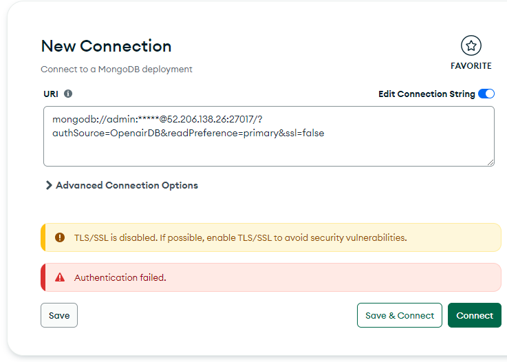
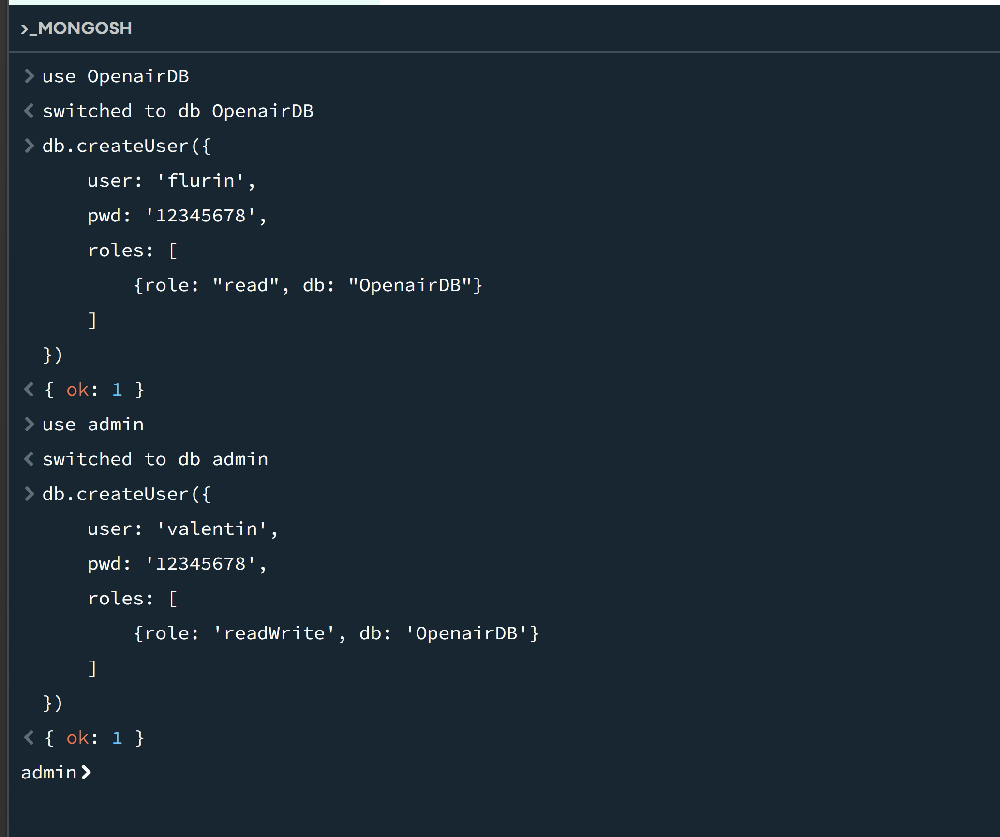
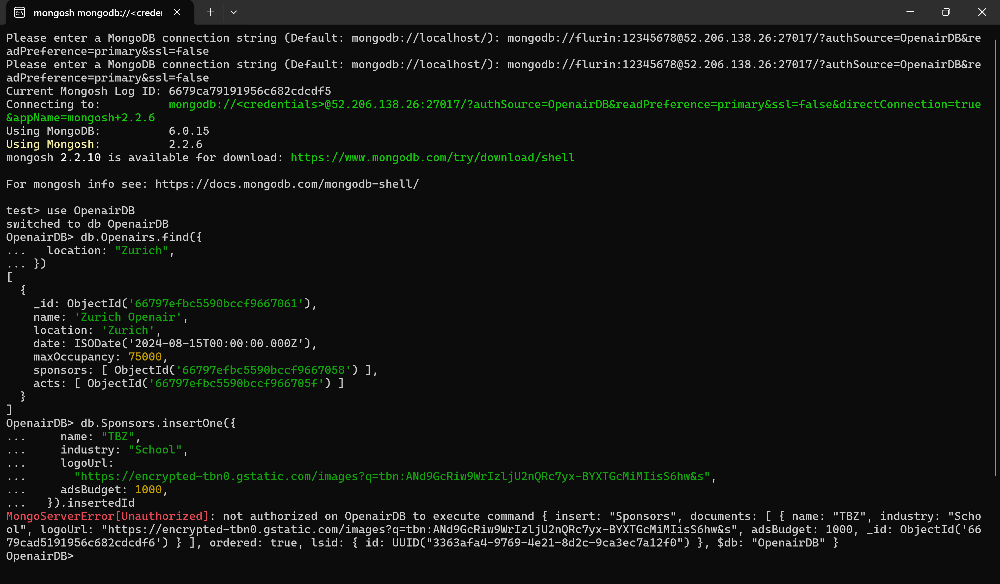
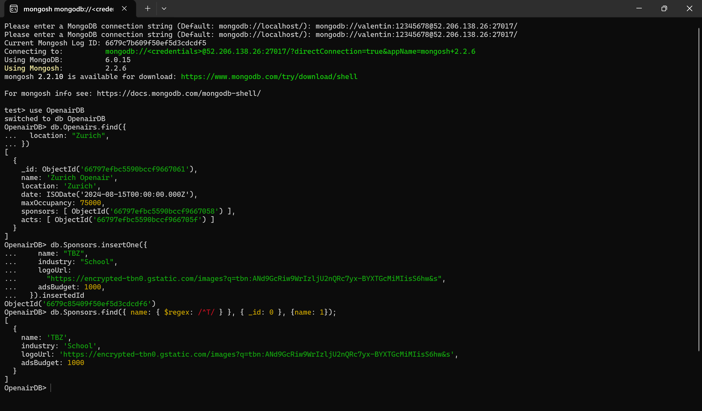
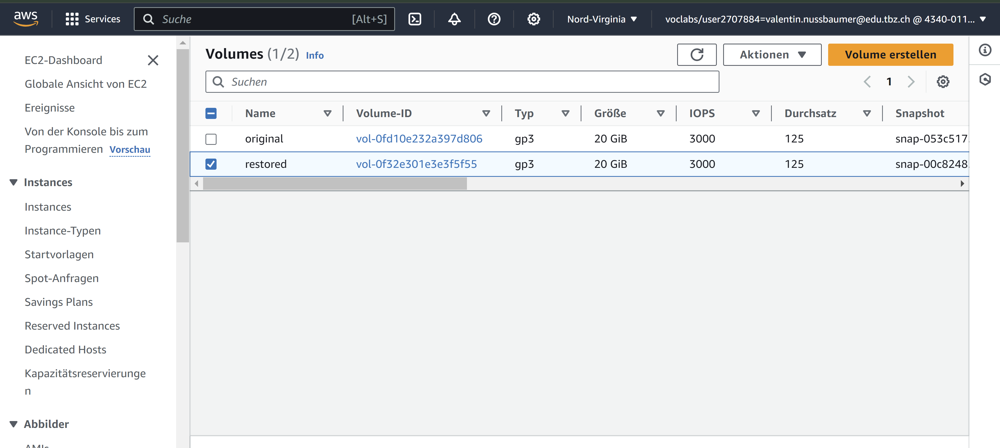
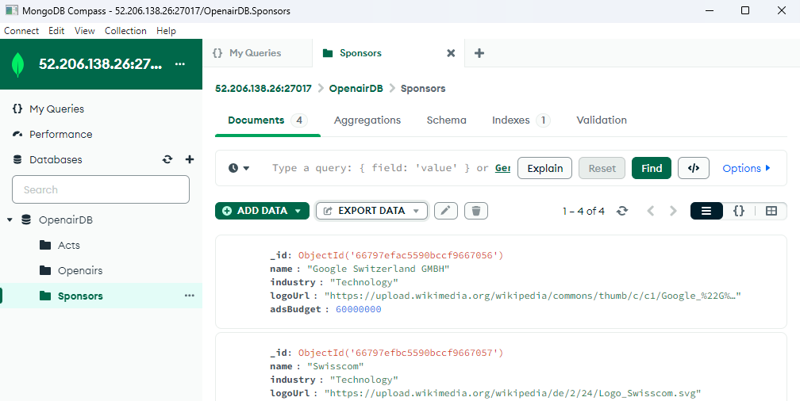
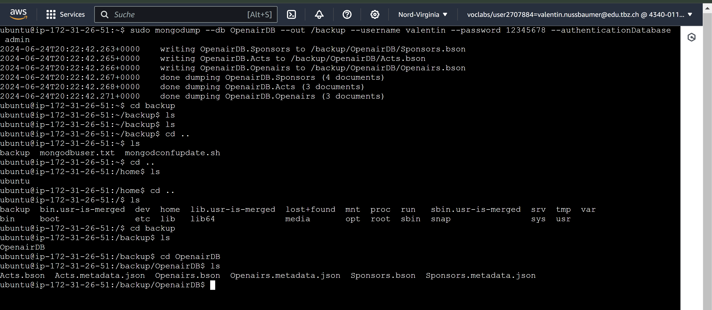
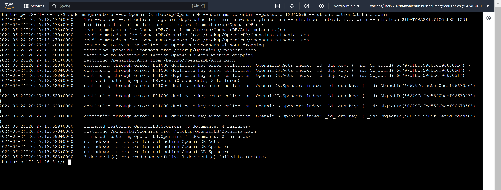
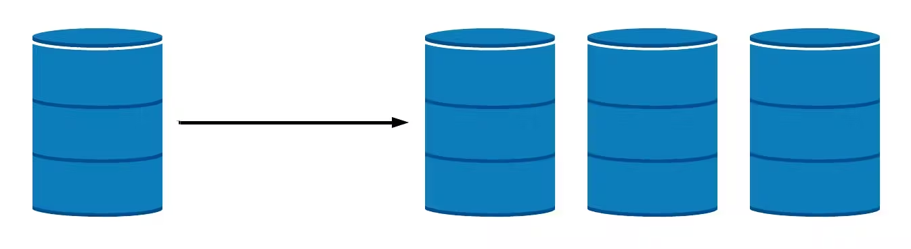
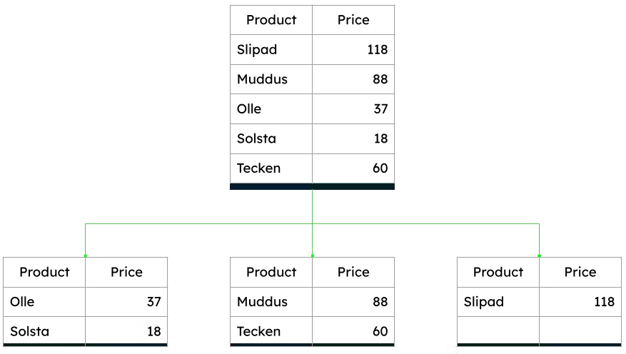

#  KN05: Administration von MongoDB 
##  A) Rechte und Rollen (40%) 

Nach dem ändern auf OpenairDB funktionierte es nicht mehr.

```
use OpenairDB

db.createUser({
    user: 'flurin',
    pwd: '12345678',
    roles: [
        {role: "read", db: "OpenairDB"}
    ]
})

```
```
use admin

db.createUser({
    user: 'valentin',
    pwd: '12345678',
    roles: [
        {role: 'readWrite', db: 'OpenairDB'}
    ]
})


```



### flurin (r)

### valentin (rw)


##  B) Backup und Restore (40%)
### Variante 1
Before delete

Snapshot

Löschung von Openairs

Restore des Volumes und anhängen an Instanz.


Erfolgreich restored


Ich musste keine befehle ausführen. Ich habe alles in der AWS UI gemacht.


### Variante 2
#### Dump von DB
`sudo mongodump --db OpenairDB --out /backup --username valentin --password 12345678 --authenticationDatabase admin`



#### Löschung der Openairs Tabelle
Before:

After:


#### Restore
`sudo mongorestore --db OpenairDB /backup/OpenairDB --username valentin --password 12345678 --authenticationDatabase admin`

After:

## C) Skalierung (20%)
### Replikation
Replikation in MongoDB bedeutet das Kopieren von Daten von einem Server (Primär) zu einem oder mehreren anderen Servern (Sekundär). Dies dient hauptsächlich der Erhöhung der Verfügbarkeit und Zuverlässigkeit der Daten.



### Partition (Sharding)
Sharding ist das Aufteilen von Daten in kleinere, verteilte Segmente, die auf verschiedenen Servern gespeichert werden. Dies dient hauptsächlich der Skalierung und Leistungssteigerung grosser Datenmengen.



### Empfehlung an meine Firma (Google)
Bei meiner Firma, also der Suchmaschiene Google empfehle ich die Implementierung von Sharding zur Handhabung grosser Datenmengen und zur Verbesserung der Leistung. Kombiniert mit Replikation innerhalb der Shards, um Ausfallsicherheit und Verfügbarkeit zu gewährleisten.

