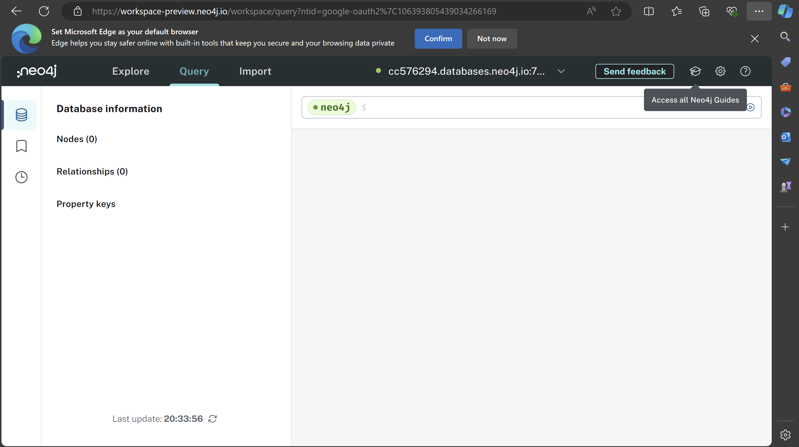
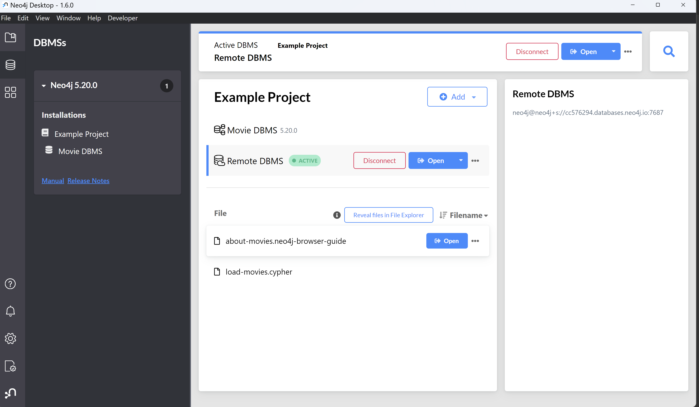
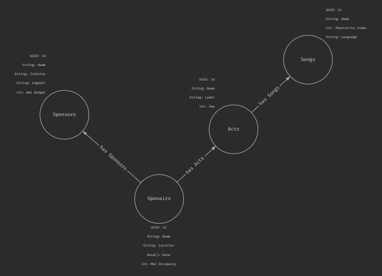
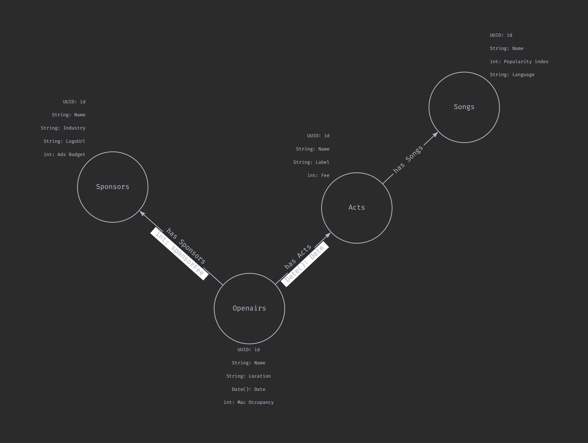

#  KN07: Installation und Datenmodellierung für Neo4j
##  A) Installation / Account erstellen (30%) 
<hide param="Username: neo4j
Password: 0TSUoYskgu7K74dEq16NtExsfZw70LKdoMvR3lEykXk"></hide>


Ich konnte mich erfolgreich von der Desktop App aus verbinden.


##  B) Logisches Modell für Neo4j (70%)

<br>
Hier noch zusätzlich mit den Datentypen <br>


Daten das Diagrammes als Cyper Clause
```
CREATE (:`UUID: id`:`String: Name`:`String: Industry`:`String: LogoUrl`:`int: Ads Budget`)<-[:has Sponsors {int: "sponsorFee"}]-(:`UUID: id`:`String: Name`:`String: Location`:`Date(): Date`:`int: Mac Occupancy`)-[:has Acts {`Date()`: "Date"}]->(:`UUID: id`:`String: Name`:`String: Label`:`int: Fee`)-[:has Songs]->(:`UUID: id`:`String: Name`:`int: Popularity index`:`String: Language`)
```
[Link zum File (Google Drive)](https://drive.google.com/file/d/13k2ezN4ZVqIAFjyC3O9phUDOs7c0LbU0/view?usp=sharing) <br><br>
Ich habe eigentlich alles aus dem Logischem Diagram von [KN02](../KN02/readme.md) übernommen. Die Verschachtelung habe ich rausgemommen, da sie nicht nötig ist. Das selbe gilt für die referenz nur verbundenen cpllection (z.B Array(ActId): acts). Die referenzen habe ich gleich implementiert. Bei den DatenTypen der refernzen war ich mir aber nicht ganz sicher.