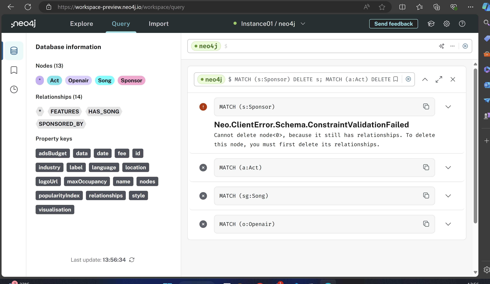
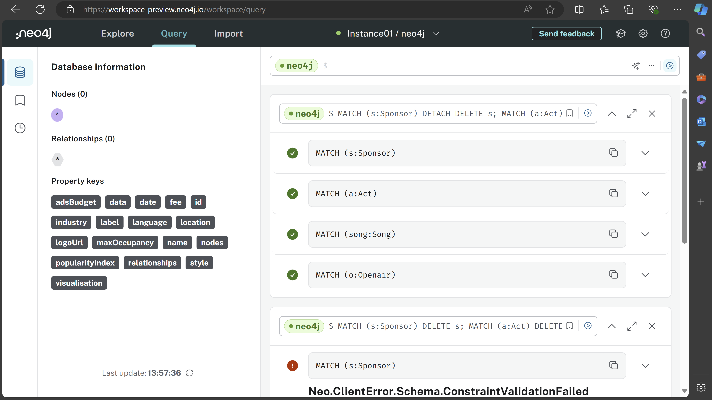

# KN08: Datenabfrage und -Manipulation 
## A) Daten hinzufügen (20%)
[Script File](insert.txt)

## B) Daten abfragen (20%)
### Szenario 1: Alle Acts mit ihren Songs finden.
Anwendungsfall: Ich möchte alle Acts finden und die Songs auflisten, die sie aufführen.

Cypher-Statements:
```
MATCH (a:Act)
OPTIONAL MATCH (a)-[:HAS_SONGS]->(s:Song)
RETURN a.name AS Act, s.name AS Song, s.popularityIndex AS Popularität
ORDER BY a.name;

```

### Szenario 2: Finde alle Openairs mit ihren Sponsoren und Acts
Anwendungsfall: Ich möchte alle Openair-Veranstaltungen finden und die Sponsoren und Acts auflisten, die daran beteiligt sind.


Cypher-Statement:
```
MATCH (o:Openair)
OPTIONAL MATCH (o)-[:HAS_SPONSORS]->(s:Sponsor)
OPTIONAL MATCH (o)-[:HAS_ACTS]->(a:Act)
RETURN o.name AS Openair, s.name AS Sponsor, a.name AS Act
ORDER BY o.date;
```

### Szenario 3: Finde Acts mit Songs in einer bestimmten Sprache
Anwendungsfall: Ich möchte Acts finden, die Songs in der Sprache "Deutsch" aufführen.

Cypher-Statement:
```
MATCH (a:Act)-[:HAS_SONGS]->(s:Song)
WHERE s.language = "German"
RETURN a.name AS Act, s.name AS Song
ORDER BY a.name;
```
### Szenario 4: Finde Openairs mit Sponsoren, deren Werbebudget größer als 100.000 ist.
Anwendungsfall: Ich möchten Openairs finden, die von Sponsoren mit einem Werbebudget von mehr als 100.000 gesponsert werden.

Cypher-Statement:
```
MATCH (o:Openair)-[hs:HAS_SPONSORS]->(s:Sponsor)
WHERE s.adsBudget > 100000
RETURN o.name AS Openair, s.name AS Sponsor, s.adsBudget AS Budget, hs.sponsorFee AS SponsorFee
ORDER BY s.adsBudget DESC;
```

### Erklährung
Das MATCH-Statement in Neo4j wird verwendet, um Muster in der Datenbank zu finden. Es sucht nach Knoten und deren Beziehungen (Kanten) basierend auf angegebenen Kriterien.
<br>

Die OPTIONAL MATCH-Klausel in Neo4j ermöglicht es, Muster in der Datenbank zu finden, bei denen das gefundene Muster optional sein kann. Das bedeutet, dass, selbst wenn das Muster nicht gefunden wird, die übrigen Teile des Musters in das Ergebnis einbezogen werden, jedoch mit NULL-Werten für die nicht gefundenen Teile. Sie wird verwendet, um sicherzustellen, dass bestimmte Beziehungen oder Muster vorhanden sein können, aber nicht erforderlich sind, um das Ergebnis zurückzugeben.


## C) Daten löschen (20%)
Wie man hier sehen kann funktioniert die delete methode alleine nicht. Das kommt daher, da man mit dem delet befehl nur die node löscht. Die geht ja nicht, da die nodes ja noch relationships habe. Deshalb wird der fehler ausgegeben.

[Delete Method](delete.txt)

Bei der Detatch methode funktioniert es hingegen. Dies kommt daher, da durch das hinzufügen des Detach befehles zuerst die relationship zwischen den nodes aufgelöst. Deshalb kann der node danach problemlos gelöscht werden.

[Detach Method](detach.txt)

## D) Daten verändern (20%)

### Szenario 1: Aktualisierung der Gage eines Künstlers

Anwendungsfall: Ich möchte die Gage von Travis Scott erhöhen.

Cypher-Statement:
```
MATCH (a:Act {name: "Travis Scott"})
SET a.fee = 6000000
RETURN a
```

### Szenario 2: Änderung des Datums eines Openair-Festivals

Anwendungsfall: Ich möchte das Datum des Zurich Openair verschieben.

Cypher-Statement:
```
MATCH (o:Openair {name: "Zurich Openair"})
SET o.date = date("2024-08-22")
RETURN o
```

### Szenario 3: Hinzufügen eines neuen Sponsors zu einem Festival

Anwendungsfall: Ich möchte Google Switzerland GMBH als neuer Sponsor zum Openair Frauenfeld hinzugefügen.

Cypher-Statement:
```
MATCH (o:Openair {name: "Openair Frauenfeld"})
MATCH (s:Sponsor {name: "Google Switzerland GMBH"})
CREATE (o)-[r:HAS_SPONSORS {sponsorFee: 100000}]->(s)
RETURN o, s, r
```

## E) Zusätzliche Klauseln (20%)
### 1. UNION

Erklärung:
UNION verbindet die Ergebnisse von zwei oder mehr Abfragen zu einer Liste.

Anwendungsfall:
Ich will eine Liste aller Acts und Sponsoren des Openair Frauenfeld erstellen.

Cypher-Statement:
```cypher
MATCH (o:Openair {name: "Openair Frauenfeld"})-[:HAS_ACTS]->(a:Act)
RETURN a.name AS name
UNION
MATCH (o:Openair {name: "Openair Frauenfeld"})-[:HAS_SPONSORS]->(s:Sponsor)
RETURN s.name AS name
```

Erklärung meines spezifischen Beispieles:
Dieses Statement findet zuerst alle Acts und dann alle Sponsoren des Festivals. UNION fügt diese beiden Listen zu einer zusammen.

### 2. FOREACH

Erklärung:
FOREACH führt eine Aktion für jedes Element in einer Liste aus.

Anwendungsfall:
Ich will die Popularität aller Songs von Pashanim um 5 Punkte erhöhen.

Cypher-Statement:
```cypher
MATCH (a:Act {name: "Pashanim"})-[:HAS_SONGS]->(s:Song)
WITH a, collect(s) AS songs
FOREACH (song IN songs |
  SET song.popularityIndex = song.popularityIndex + 5
)
RETURN a, songs
```

Erklärung meines spezifischen Beispieles:
Dieses Statement findet alle Songs von Pashanim, sammelt sie in einer Liste und erhöht dann die Popularität jedes Songs um 5 Punkte.


